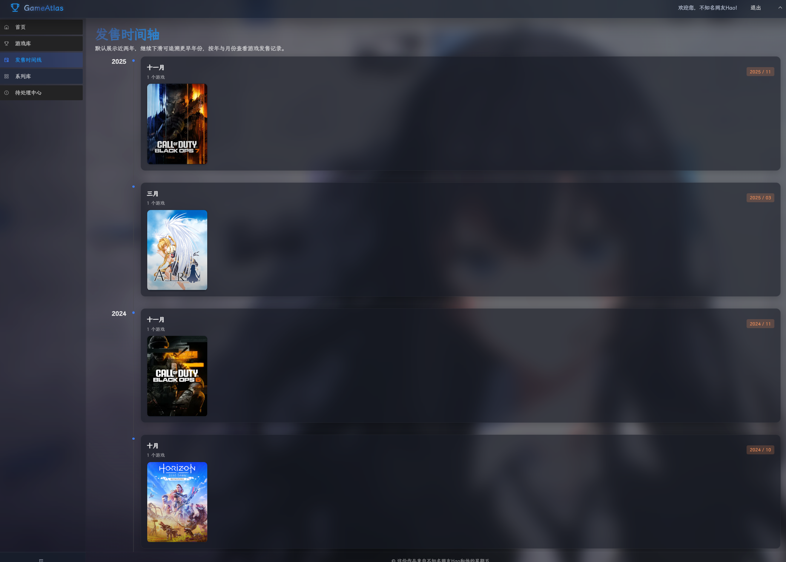
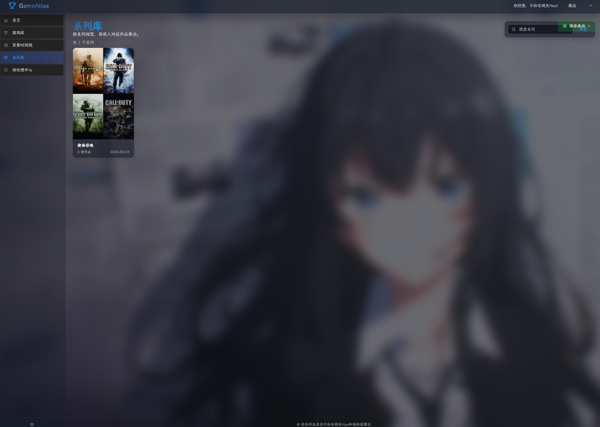
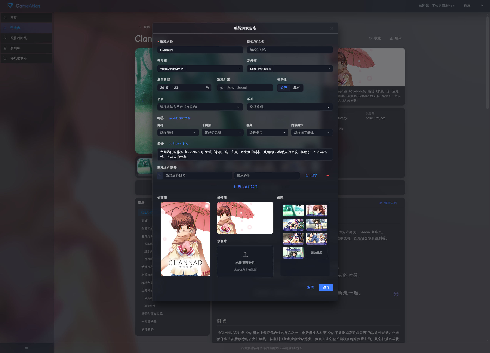
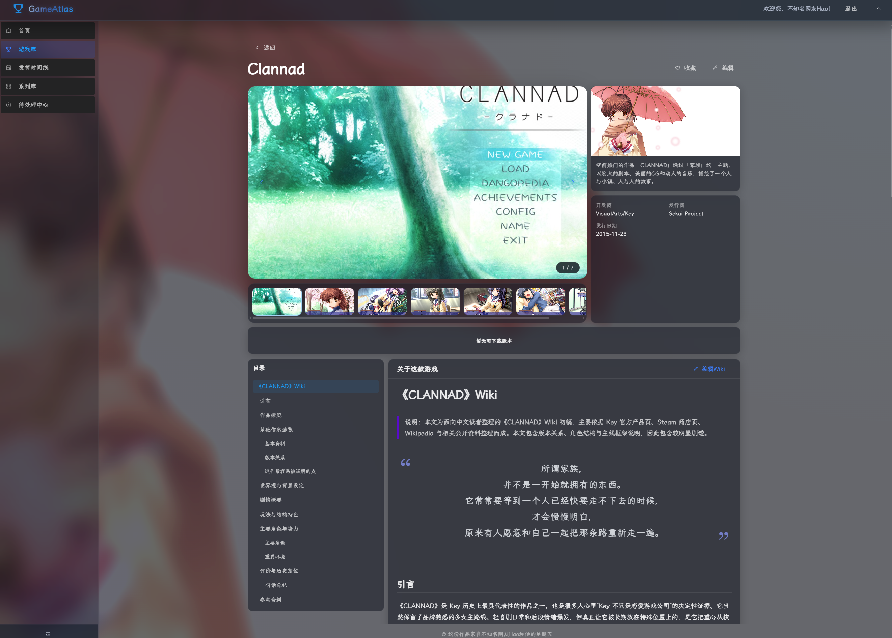

# GameAtlas

一个适合 NAS、局域网和家庭游戏库场景的游戏管理系统。

它的核心价值不是“把文件列出来”，而是把游戏资料、截图、Wiki、版本文件和启动入口统一收进一个网页里。对这个项目来说，最重要的能力是：

- 在网页里整理和浏览游戏库
- 给游戏挂封面、横幅、截图、视频和 Wiki
- 为 `.vhd` / `.vhdx` 游戏文件生成 Windows 启动脚本
- 让局域网内的 Windows 机器通过 SMB + 差分盘方式远程启动游戏

## 项目适合什么场景

- 游戏文件集中放在一台 NAS / 服务器 / 主机上
- 你希望在浏览器里统一管理游戏资料和文件版本
- 你希望客户端尽量少复制大体积镜像文件
- 你使用 `.vhd` 或 `.vhdx` 作为游戏容器，并接受在 Windows 客户端挂载后进入磁盘游玩

如果你的文件不是 VHD/VHDX，这个项目依然可以做游戏资料库和下载管理，但“开始游玩”这条链路主要是为 VHD 远程启动设计的。

## 它是怎么用的

日常使用流程很简单：

1. 部署服务端，打开网页。
2. 管理员登录后新增游戏。
3. 为游戏补充封面、横幅、截图、Wiki 和文件版本。
4. 如果某个版本文件是 `.vhd` 或 `.vhdx`，详情页里会出现“开始游玩”入口。
5. Windows 客户端点击后会下载一个 `.bat`。
6. 在客户端以管理员权限运行这个 `.bat`，脚本会连接 SMB、创建或复用本地差分盘、挂载 VHD。
7. 挂载成功后，去“此电脑”里打开新出现的盘符开始游玩。

## 界面预览

### 首页


### 时间线



### 系列库



### 游戏编辑页



### 详情页



## 技术栈

- 后端：Go + Gin + SQLite
- 前端：Vue 3 + TypeScript + Vite + Pinia + Arco Design Vue

## 目录结构

```text
.
├── backend/            # Go 后端、数据库迁移、嵌入式前端资源
├── frontend/           # Vue 3 前端
├── Readme/             # README 截图
├── build-release.sh    # 生产打包脚本
└── start-dev.sh        # 本地联调脚本
```

## 本地开发

需要：

- Go 1.22 或更高版本
- Node.js 和 npm
- curl

根目录执行：

```bash
bash start-dev.sh
```

默认地址：

- 前端：`http://127.0.0.1:5173`
- 后端：`http://127.0.0.1:3000`

这个脚本会自动：

- 检查 `go`、`npm`、`curl`
- 缺依赖时执行前端 `npm install`
- 预热 Go 依赖
- 启动后端
- 等待健康检查通过后启动前端

如果你更喜欢分开启动：

```bash
cd backend
go run ./cmd/server
```

```bash
cd frontend
npm install
npm run dev
```

## 生产部署

根目录执行：

```bash
bash build-release.sh
```

也可以自定义版本名：

```bash
bash build-release.sh v1.0.0
```

发布目录类似：

```text
release/game-release-<version>/
├── game-server
├── start.sh
├── .env
├── data/
│   ├── app.db
│   ├── gamelist/
│   └── bg.jpg
└── ROM/
```

部署步骤建议按这个顺序：

1. 执行 `build-release.sh`
2. 进入生成的发布目录
3. 编辑 `.env`
4. 至少填写管理员密码，并确认 ROM、素材目录和 SMB 配置正确
5. 运行 `./start.sh`

后端默认监听 `3000` 端口。

## 如何用 GitHub Release 发发布包

当前仓库已经配置了 GitHub Actions 自动发版。

推荐方式是：

1. 提交代码
2. 推送一个版本 tag
3. GitHub Actions 自动构建发布包
4. 自动创建或更新对应的 GitHub Release
5. 自动上传压缩包和校验文件

工作流文件在：

- [.github/workflows/release.yml](/home/Hao/Game/.github/workflows/release.yml)

### 推荐流程

本地打 tag 并推送：

```bash
git tag v1.0.0
git push origin v1.0.0
```

触发条件是：

- 推送 tag
- tag 名符合 `v*`
- 例如 `v1.0.0`、`v1.2.3`

工作流会自动完成：

- 安装前端依赖
- 下载 Go 依赖
- 执行 `build-release.sh <tag>`
- 生成 Linux 发布目录
- 打出 `tar.gz` 和 `zip`
- 生成 `sha256` 校验文件
- 上传到 GitHub Release

最终 Release 附件会包含：

- `game-release-<version>-linux-amd64.tar.gz`
- `game-release-<version>-linux-amd64.zip`
- `game-release-<version>-checksums.txt`

### 第一次使用前要确认

- 仓库必须开启 GitHub Actions
- 推送 tag 的账号需要有仓库写权限
- Actions 需要有 `contents: write` 权限创建 Release
- 当前工作流产物是 `linux-amd64` 发布包，适合 Linux / NAS 服务器部署

### 下载者拿到 Release 后怎么用

下载并解压后，进入发布目录：

1. 修改 `.env`
2. 至少填写 `ADMIN_PASSWORD`
3. 按实际环境调整 `PRIMARY_ROM_ROOT`、`SMB_SHARE_ROOT` 等配置
4. 执行 `./start.sh`

### 手动上传仍然可用

如果你临时不想走 Actions，也仍然可以手动执行：

```bash
bash build-release.sh v1.0.0
```

然后把 `release/game-release-v1.0.0/` 自己压缩后上传到 GitHub Release。

## 必须先理解的 VHD 远程启动

这是这个项目最重要的使用方式。

### 启动原理

服务端不会直接替你“远程运行游戏 EXE”。它实际做的是：

1. 游戏文件登记为 `.vhd` 或 `.vhdx`
2. 网页详情页点击“开始游玩”
3. 后端生成一个 Windows `BAT`
4. 客户端执行这个 `BAT`
5. `BAT` 连接服务端 SMB 共享，定位基础 VHD
6. 客户端本地创建一个差分 VHDX
7. 使用 `diskpart` 挂载差分盘
8. 你再从挂载出来的盘符里进入游戏

也就是说：

- 基础盘放在服务端
- 差分盘落在客户端本机
- 客户端每次游玩时挂载的是“本地差分盘 + 远端基础盘”

### 为什么这么设计

这样做有几个实际好处：

- 基础镜像不用在每台机器上复制一份
- 每台客户端都能保留自己的差分写入
- 服务端只需要维护一份只读基础游戏盘
- 更适合局域网和 NAS 场景

### 服务端要满足什么条件

1. 游戏文件必须登记在 `PRIMARY_ROM_ROOT` 目录内
2. 游戏文件扩展名必须是 `.vhd` 或 `.vhdx`
3. 服务端必须能通过 SMB 共享把这批文件暴露出来
4. `.env` 中必须正确填写：

```env
PRIMARY_ROM_ROOT=ROM
SMB_SHARE_ROOT=\\192.168.1.4\Game1
SMB_USERNAME=game
SMB_PASSWORD=game
VHD_DIFF_ROOT=C:
```

这些字段的含义：

- `PRIMARY_ROM_ROOT`
  游戏文件真实所在目录。登记文件、目录浏览、文件下载都只能落在这个根目录里。
- `SMB_SHARE_ROOT`
  Windows 客户端访问基础 VHD 时使用的 UNC 路径。
- `SMB_USERNAME`
  连接 SMB 共享时写入 BAT 的用户名。
- `SMB_PASSWORD`
  连接 SMB 共享时写入 BAT 的密码。
- `VHD_DIFF_ROOT`
  客户端差分盘保存在哪个盘符根目录下，例如 `C:` 或 `D:`。

### Windows 客户端要满足什么条件

1. 能访问服务端 SMB 共享
2. 能使用 `cmdkey`
3. 能使用 `net use`
4. 能使用 `diskpart`
5. 运行 BAT 时具备管理员权限

项目生成的 BAT 会自动尝试提权；如果客户端系统策略拦截 UAC 或禁用了相关能力，挂载会失败。

### 实际使用步骤

1. 在后台新增一个游戏
2. 给游戏添加文件版本，文件路径指向 `PRIMARY_ROM_ROOT` 内的 `.vhd` 或 `.vhdx`
3. 在游戏详情页点击“开始游玩”
4. 浏览器会下载一个 `.bat`
5. 到 Windows 客户端运行这个 `.bat`
6. 脚本会自动：
   - 写入 SMB 凭据
   - 连接共享目录
   - 检查本地差分盘是否存在
   - 不存在则基于远程基础盘创建差分 VHDX
   - 调用 `diskpart` 挂载
7. 挂载成功后，在“此电脑”中打开新盘符进入游戏

### 差分盘放在哪里

差分盘文件名默认与基础盘同名，保存在：

```text
<VHD_DIFF_ROOT>\<基础盘文件名>
```

例如：

- 基础盘：`\\192.168.1.4\Game1\PS2\GT4.vhd`
- 差分盘：`C:\GT4.vhd`

这意味着：

- 同名基础盘可能会在客户端产生同名差分文件冲突
- 更适合给 VHD 文件起稳定且尽量唯一的名称

### 常见失败原因

- `SMB_SHARE_ROOT` 配错，客户端根本连不上共享
- `PRIMARY_ROM_ROOT` 和实际 SMB 暴露目录不是同一套内容
- 游戏登记的路径不在 `PRIMARY_ROM_ROOT` 内
- 文件不是 `.vhd` / `.vhdx`
- Windows 没有管理员权限，`diskpart` 挂载失败
- 客户端没有足够权限写入 `VHD_DIFF_ROOT`
- 服务端改了共享地址，但旧游戏文件登记路径和 SMB 路径关系没同步调整

如果网页能看到“开始游玩”，但 BAT 运行失败，优先检查：

1. 客户端能否手动访问 `SMB_SHARE_ROOT`
2. 基础 VHD 文件在共享路径下是否真实存在
3. BAT 是否成功以管理员权限运行
4. `VHD_DIFF_ROOT` 所在盘是否可写

## 常用配置

后端启动时会读取发布目录或 `backend/` 下的 `.env`。

### 最低必填项

```env
ADMIN_PASSWORD=你的密码
SESSION_SECRET=随机长字符串
```

注意：

- `ADMIN_PASSWORD` 不能为空
- `SESSION_SECRET` 不能为空，也不能保留默认值 `change-me`
- 任一条件不满足时，后端会直接拒绝启动

### 常用路径配置

```env
DB_PATH=data/app.db
ASSETS_DIR=data/gamelist
PRIMARY_ROM_ROOT=ROM
```

### 常用服务配置

```env
APP_ENV=production
HOST=0.0.0.0
PORT=3000
```

## 管理员如何录入一个游戏

推荐按下面的顺序录入，这样页面会比较完整：

1. 登录管理员账号
2. 新增游戏基础信息
3. 上传封面、横幅、截图、视频
4. 编写 Wiki
5. 添加标签、系列、平台、开发商、发行商
6. 添加一个或多个文件版本
7. 如果版本文件是 VHD/VHDX，再验证“开始游玩”是否正常

项目当前支持：

- 仪表盘
- 游戏列表
- 游戏详情
- 发售时间线
- 系列库和系列详情
- Wiki 编辑
- 待处理中心
- Steam 搜索和素材导入

## 权限与访问边界

- 默认浏览场景支持匿名访问
- 管理员登录后才允许新增、编辑、删除、上传素材、编辑 Wiki 等写操作
- 登录态由后端 Cookie 提供
- 文件下载和启动脚本下载支持“管理员或局域网访问”的边界

如果你把服务暴露到更大范围网络，建议额外做：

- 反向代理
- HTTPS
- 外层访问控制
- 对 SMB 共享做单独隔离

## 相关脚本

- [start-dev.sh](/home/Hao/Game/start-dev.sh)
  本地开发一键启动
- [build-release.sh](/home/Hao/Game/build-release.sh)
  生成可部署发布包

## 补充说明

- 根目录 README 现在优先服务“如何使用这个项目”
- 更偏后端实现细节的说明可以看 [backend/README.md](/home/Hao/Game/backend/README.md)
- 当前项目的远程启动能力是围绕 Windows + SMB + VHD/VHDX 挂载来设计的
