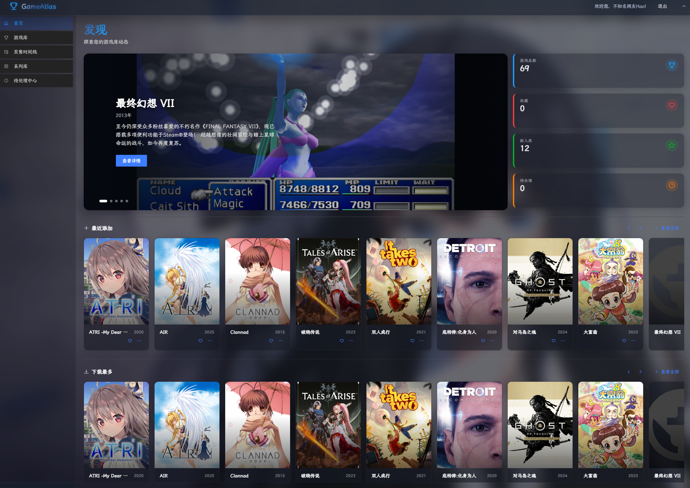
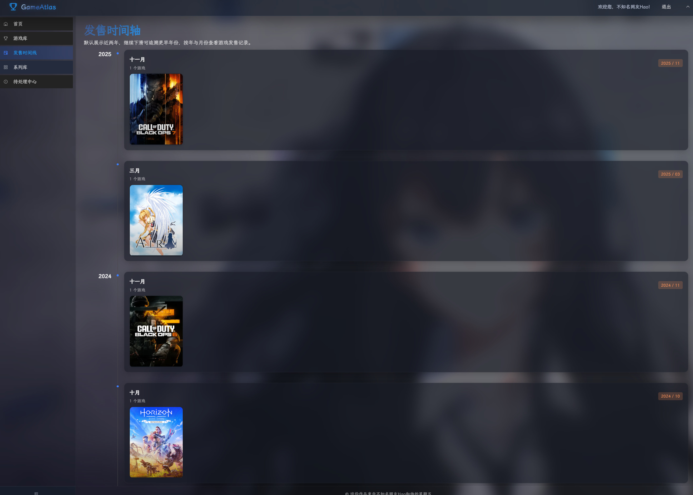
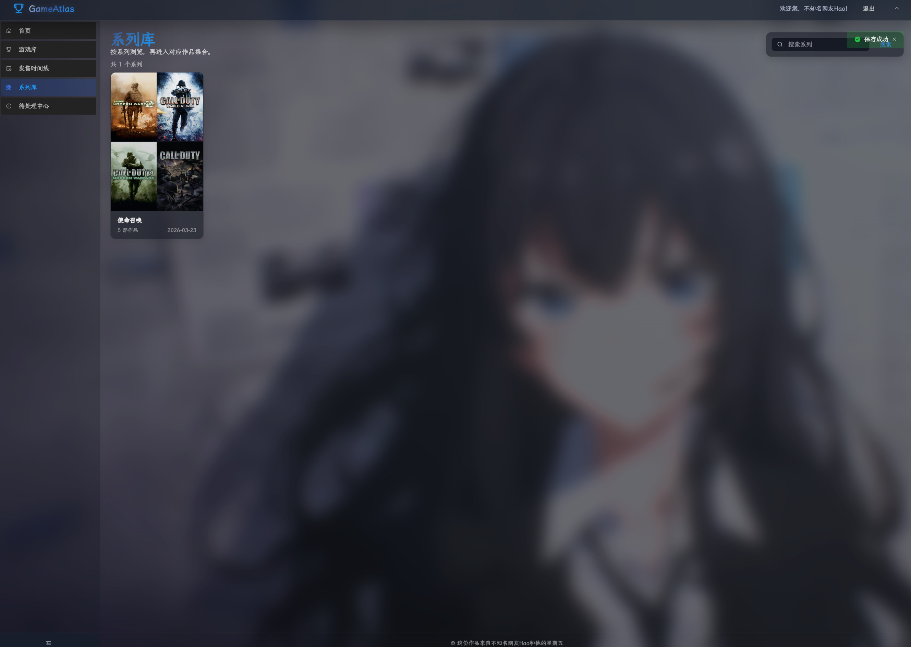
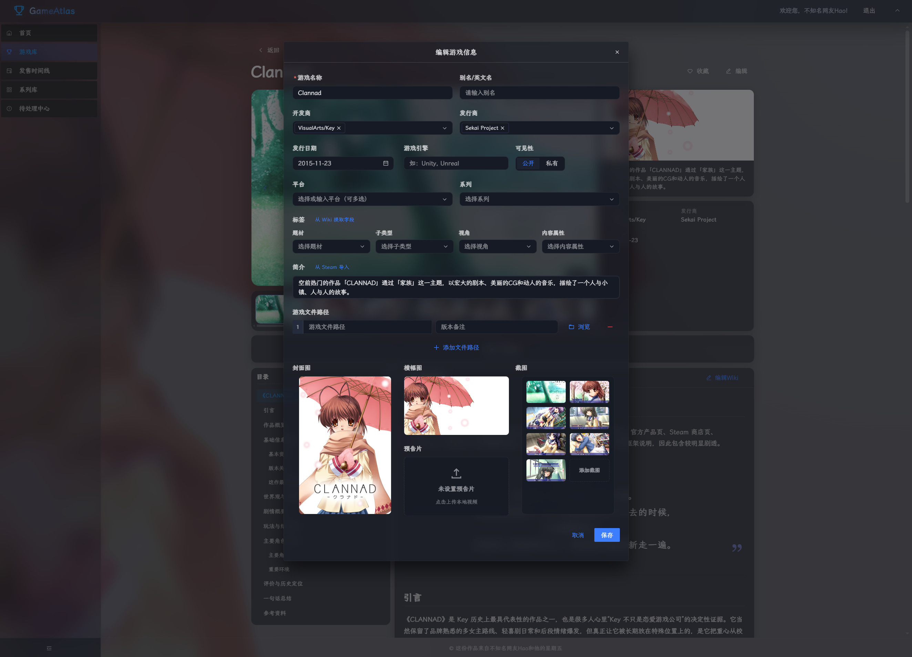
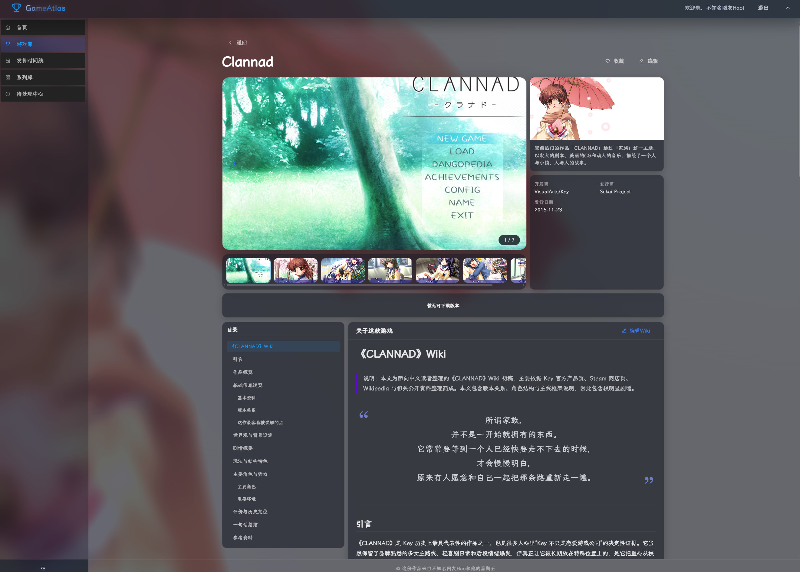

# GameAtlas

游戏管理系统，面向 NAS / 局域网 / 家庭游戏库场景。核心能力：

- 在网页里整理和浏览游戏库（封面、横幅、截图、视频、Wiki）
- Steam / SteamGridDB 在线素材搜索与导入
- 管理 `.vhd` / `.vhdx` 游戏文件版本
- 通过 SMB + 差分盘方式让 Windows 客户端远程挂载并启动游戏

## 界面预览

| 首页 | 时间线 | 系列库 |
|------|--------|--------|
|  |  |  |

| 游戏编辑页 | 详情页 |
|------------|--------|
|  |  |

## 技术栈

- 后端：Go + Gin + SQLite
- 前端：Vue 3 + TypeScript + Vite + Pinia + Arco Design Vue

## 本地开发

需要 Go 1.22+、Node.js、npm、curl。

```bash
bash start-dev.sh          # 一键启动（后端 :3000，前端 :5173）
```

或手动启动：

```bash
cd backend && go run ./cmd/server
cd frontend && npm install && npm run dev
```

## 生产部署

### 方式一：Docker（推荐）

```bash
# 拉取镜像
docker pull hao0114/gameatlas:latest

# 运行
docker run -d \
  --name gameatlas \
  -p 3000:3000 \
  -v /mnt/Docker/GameAtlas/data:/app/data \
  -v /mnt:/mnt:ro \
  -e ADMIN_PASSWORD=yourpassword \
  hao0114/gameatlas:latest
```

或使用 docker-compose：

```yaml
services:
  gameatlas:
    image: hao0114/gameatlas:latest
    container_name: gameatlas
    restart: unless-stopped
    ports:
      - "3000:3000"
    volumes:
      - /mnt/Docker/GameAtlas/data:/app/data
      - /mnt:/mnt:ro
    environment:
      ADMIN_PASSWORD: yourpassword
```

首次启动会自动创建默认配置文件。

### 方式二：二进制

```bash
bash build-release.sh              # 输出到 release/game-release-<version>/
bash build-release.sh v1.0.0       # 自定义版本名
```

发布目录结构：

```text
release/game-release-<version>/
├── game-server
├── data/                 # 首次启动自动创建
│   ├── .env              # 配置文件（默认密码 1234）
│   └── gamelist/         # 素材目录
└── ROM/                  # 游戏文件目录
```

进入发布目录，运行 `./game-server`，首次启动会自动创建 `data/.env`。

### GitHub Release 自动发版

推送 `v*` 格式的 tag 即可触发 Actions 自动构建并上传到 GitHub Release + Docker Hub：

```bash
git tag v1.0.0 && git push origin v1.0.0
```

产物包含：
- GitHub Release：`tar.gz`、`zip` 和 `sha256` 校验文件（`linux-amd64`）
- Docker Hub：`hao0114/gameatlas:v1.0.0`、`hao0114/gameatlas:latest`

## 配置

程序首次启动会自动在 `data/` 目录创建 `.env` 配置文件（默认密码 `1234`）。

配置查找优先级：
1. `data/.env`（推荐）
2. `./.env`（兼容）

详细配置项见 `backend/.env.example`，关键配置：

```env
# 必填
ADMIN_PASSWORD=你的密码

# 路径
DB_PATH=data/db.db
ASSETS_DIR=data/gamelist
PRIMARY_ROM_ROOT=/mnt           # 游戏文件根目录

# SMB / VHD
SMB_PATH_MAPPINGS=/mnt/Game=\\192.168.1.4\Game;/mnt/Gal=\\192.168.1.4\Gal
SMB_USERNAME=game
SMB_PASSWORD=game
VHD_DIFF_ROOT=C:                # 客户端差分盘存放位置

# 可选：SteamGridDB 在线素材搜索
STEAMGRIDDB_API_KEY=            # 注册：https://www.steamgriddb.com/account
```

## VHD 远程启动

这是项目最核心的使用方式。

### 原理

1. 游戏文件登记为 `.vhd` / `.vhdx`，放在服务端 `PRIMARY_ROM_ROOT` 内
2. 网页详情页点击"开始游玩"，后端生成 Windows BAT 脚本
3. 客户端以管理员权限运行 BAT — 自动连接 SMB、创建本地差分盘、挂载 VHD
4. 从挂载出的盘符进入游戏

基础盘在服务端只读共享，差分盘在客户端本地，每台机器保留独立写入。

### 服务端条件

- 游戏文件在 `PRIMARY_ROM_ROOT` 内，扩展名为 `.vhd` / `.vhdx`
- 文件通过 SMB 共享暴露
- `.env` 中正确配置 `SMB_SHARE_ROOT`（或 `SMB_PATH_MAPPINGS`）、`SMB_USERNAME`、`SMB_PASSWORD`、`VHD_DIFF_ROOT`

### 客户端条件

- 能访问服务端 SMB 共享
- 支持 `cmdkey`、`net use`、`diskpart`
- BAT 需以管理员权限运行（脚本会自动尝试提权）

### 从零到可玩

1. 在 Windows 上创建基础 VHDX 并灌入游戏文件：

```powershell
New-VHD -Path "D:\GameBase\PS2_GT4.vhdx" -SizeBytes 120GB -Dynamic
Mount-VHD -Path "D:\GameBase\PS2_GT4.vhdx"
Initialize-Disk -Number (Get-Disk | Where-Object PartitionStyle -Eq 'RAW' | Select-Object -First 1).Number -PartitionStyle GPT
$part = New-Partition -DiskNumber (Get-Disk | Sort-Object Number -Descending | Select-Object -First 1).Number -UseMaximumSize -AssignDriveLetter
Format-Volume -Partition $part -FileSystem NTFS -NewFileSystemLabel "GT4_BASE"
```

2. 卸载 VHD，放到服务端 `PRIMARY_ROM_ROOT` 对应目录
3. 后台新增游戏，在"文件版本"里添加 `.vhd/.vhdx` 路径
4. 详情页点击"开始游玩"，下载 BAT，Windows 客户端管理员运行

### 常见问题

- `SMB_SHARE_ROOT` / `SMB_PATH_MAPPINGS` 配错 → 客户端连不上共享
- `PRIMARY_ROM_ROOT` 和 SMB 暴露目录不一致
- 文件不在 `PRIMARY_ROM_ROOT` 内或不是 `.vhd` / `.vhdx`
- 客户端无管理员权限 → `diskpart` 挂载失败
- 差分盘路径：`<VHD_DIFF_ROOT>\<基础盘文件名>`，同名基础盘会产生冲突，建议文件名唯一

## 权限

- 匿名可浏览公开游戏
- 管理员登录后可执行写操作（增删改、上传素材、编辑 Wiki）
- 暴露到公网时建议加反向代理 + HTTPS + 外层访问控制

## 更多

- 后端实现细节：[backend/README.md](backend/README.md)
- 开发规范：[docs/项目风格约定.md](docs/项目风格约定.md)
